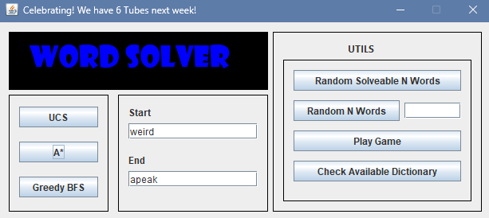
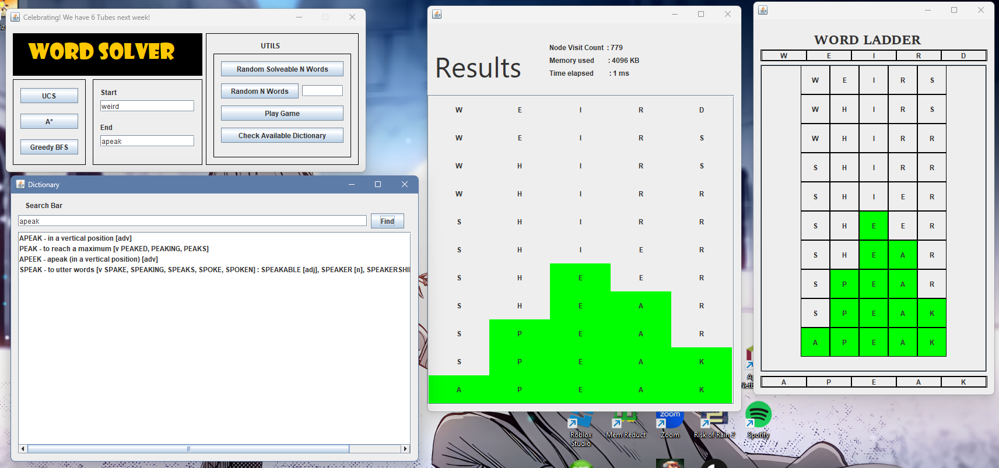

<!-- Improved compatibility of back to top link: See: https://github.com/othneildrew/Best-README-Template/pull/73 -->
<a name="readme-top"></a>
<!--
*** Thanks for checking out the Best-README-Template. If you have a suggestion
*** that would make this better, please fork the repo and create a pull request
*** or simply open an issue with the tag "enhancement".
*** Don't forget to give the project a star!
*** Thanks again! Now go create something AMAZING! :D
-->


<!-- PROJECT SHIELDS -->
<!--
*** I'm using markdown "reference style" links for readability.
*** Reference links are enclosed in brackets [ ] instead of parentheses ( ).
*** See the bottom of this document for the declaration of the reference variables
*** for contributors-url, forks-url, etc. This is an optional, concise syntax you may use.
*** https://www.markdownguide.org/basic-syntax/#reference-style-links
-->
[![Contributors][contributors-shield]][contributors-url]
[![Forks][forks-shield]][forks-url]
[![Stargazers][stars-shield]][stars-url]
[![Issues][issues-shield]][issues-url]
[![MIT License][license-shield]][license-url]
[![LinkedIn][linkedin-shield]][linkedin-url]


<!-- PROJECT LOGO -->
<br />
<div align="center">
  <a href="https://github.com/fauzanazz/Tucil3_13522153">
    
  </a>

<h3 align="center">WordLadder</h3>

  <p align="center">
    Tugas Kecil 3 IF2211 Strategi Algoritma
    <br />
    <a href="https://github.com/fauzanazz/Tucil3_13522153"><strong>Explore the docs »</strong></a>
    <br />
    <br />
    <a href="https://github.com/fauzanazz/Tucil3_13522153">View Demo</a>
    ·
    <a href="https://github.com/fauzanazz/Tucil3_13522153/issues/new?labels=bug&template=bug-report---.md">Report Bug</a>
    ·
    <a href="https://github.com/fauzanazz/Tucil3_13522153/issues/new?labels=enhancement&template=feature-request---.md">Request Feature</a>
  </p>
</div>


<!-- TABLE OF CONTENTS -->
<details>
  <summary>Table of Contents</summary>
  <ol>
    <li>
      <a href="#about-the-project">About The Project</a>
      <ul>
        <li><a href="#built-with">Built With</a></li>
      </ul>
    </li>
    <li>
      <a href="#getting-started">Getting Started</a>
      <ul>
        <li><a href="#prerequisites">Prerequisites</a></li>
        <li><a href="#installation">Installation</a></li>
      </ul>
    </li>
    <li><a href="#usage">Usage</a></li>
    <li><a href="#roadmap">Roadmap</a></li>
    <li><a href="#contributing">Contributing</a></li>
    <li><a href="#license">License</a></li>
    <li><a href="#contact">Contact</a></li>
    <li><a href="#acknowledgments">Acknowledgments</a></li>
  </ol>
</details>


<!-- ABOUT THE PROJECT -->
## About The Project
This project is a simple program developed in Java. This Programs include solver, dictionary used, random game, and actually the game. The game solver use 3 algorithm such as UCS, A*, Greedy Best First Search. The dictionary used in this program is a list of words that can be used to solve the game. The random game is a game that use random word from the dictionary to be solved. The game is a game that can be played by user to solve the word ladder.

<div align="center">
  
</div>
<p align="right">(<a href="#readme-top">back to top</a>)</p>


### Built With

* [![Java][Java]][Java-link]

<p align="right">(<a href="#readme-top">back to top</a>)</p>


<!-- GETTING STARTED -->
## Getting Started

### Prerequisites

* Operating system
  * Windows
  * Linux
  * MacOS

1. Install the Java Development Kit (JDK). You can download it from the official Oracle website. Make sure to choose the version that matches your operating system.
  Linux
    * Java
      ```sh
      sudo apt install openjdk-11-jre
      ```
  Windows
    * Java
      ```sh
      https://www.java.com/en/download/
      ```
  MacOS
    * Java
      ```sh
      https://www.java.com/en/download/
      ```


2. Set the JAVA_HOME environment variable. This tells your system where to find the JDK.
    Linux
  * Java
    ```sh
    export JAVA_HOME=/usr/lib/jvm/java-11-openjdk-amd64
    ```
  Windows
  * Java
    ```sh
    https://mkyong.com/java/how-to-set-java_home-on-windows-10/
    ```
  MacOS
  * Java
    ```sh
    https://mkyong.com/java/how-to-set-java_home-environment-variable-on-mac-os-x/
    ```

<p align="right">(<a href="#readme-top">back to top</a>)</p>

### Installation

1. Clone the repo
   ```sh
   git clone https://github.com/fauzanazz/Tucil3_13522153.git
    ```
2. Install Maven
    Linux
    ```sh
    sudo apt install maven
    ```
    Windows
    ```sh
    https://mkyong.com/maven/how-to-install-maven-in-windows/
    ```
3. Cd to the project directory
    ```sh
    cd Tucil3_13522153
    ```
4. Build the project
    ```sh
    mvn clean install
    ```
5. Run the project
    ```sh
    mvn exec:java
    ```


<p align="right">(<a href="#readme-top">back to top</a>)</p>

### Build

To Build this project you can use maven.
```sh
mvn package
```
The output jar will be in target folder.


<p align="right">(<a href="#readme-top">back to top</a>)</p>

<!-- USAGE EXAMPLES -->
## Usage

<div align="center">
  
</div>

1. Word Ladder Solver
    Solve word ladder using 3 different algorithm
    * UCS
    * A*
    * Greedy Best First Search
2. Dictionary
    Show the dictionary used in the program, and find out the meaning of the word
3. Random Game
    Play the game with random word that already in the dictionary

<p align="right">(<a href="#readme-top">back to top</a>)</p>

<!-- CONTACT -->
## Contact

Muhammad Fauzan Azhim - fauzan.azhimmm@gmail.com

Project Link: [https://github.com/fauzanazz/Tucil3_13522153](https://github.com/fauzanazz/Tucil3_13522153)

<p align="right">(<a href="#readme-top">back to top</a>)</p>


<!-- MARKDOWN LINKS & IMAGES -->
<!-- https://www.markdownguide.org/basic-syntax/#reference-style-links -->
[contributors-shield]: https://img.shields.io/github/contributors/fauzanazz/Tucil3_13522153.svg?style=for-the-badge
[contributors-url]: https://github.com/fauzanazz/Tucil3_13522153/graphs/contributors
[forks-shield]: https://img.shields.io/github/forks/fauzanazz/Tucil3_13522153.svg?style=for-the-badge
[forks-url]: https://github.com/fauzanazz/Tucil3_13522153/network/members
[stars-shield]: https://img.shields.io/github/stars/fauzanazz/Tucil3_13522153.svg?style=for-the-badge
[stars-url]: https://github.com/fauzanazz/Tucil3_13522153/stargazers
[issues-shield]: https://img.shields.io/github/issues/fauzanazz/Tucil3_13522153.svg?style=for-the-badge
[issues-url]: https://github.com/fauzanazz/Tucil3_13522153/issues
[license-shield]: https://img.shields.io/github/license/fauzanazz/Tucil3_13522153.svg?style=for-the-badge
[license-url]: https://github.com/fauzanazz/Tucil3_13522153/blob/master/LICENSE.txt
[linkedin-shield]: https://img.shields.io/badge/-LinkedIn-black.svg?style=for-the-badge&logo=linkedin&colorB=555
[linkedin-url]: https://linkedin.com/in/fauzanazhim
[java]: https://img.shields.io/badge/Java-ED8B00?style=for-the-badge&logo=openjdk&logoColor=white
[java-link]: https://www.java.com/
[mainWindow-screenshot]: images/mainWindow.png